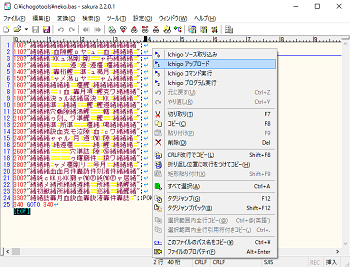
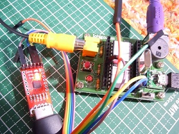
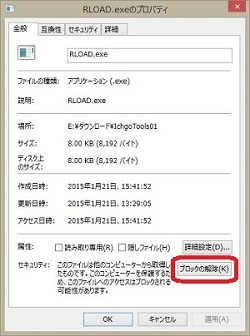
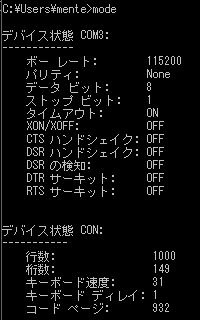
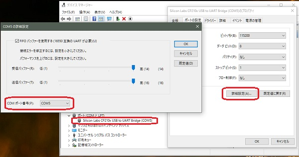

# ichigotools
##IchigoJam支援コマンド Windows版

## 概要
- コマンドプロンプト上で利用するキャラクタインタフェースのコマンドです。  
- コマンド操作でパソコンからIchigoJamのプログラムのLOAD/SAVE(シリアル通信経由)が出来ます。 
- サクラエディタ(テキストエディタ)のマクロ登録により、編集中プログラムの送受信がメニューから出来ます。  
- Windowsのマウス右メニュー「送る」に登録して、エクスプローラにて選択したファイルのLOAD/SAVEが出来ます。 

サクラエディタのメニューに登録して利用する例  
  

**※ichigotoolsの利用については、Wikiページも参照下さい。**  

## 利用環境
- IchigoJam本体(ファームウェア V1.2.1以降推奨)  
- ホストパソコン
  OSとしてWindows 10搭載機(多分,XP以降なら動くと思います)  
- USB-UARTモジュール
  パソコンとIchigoJamでシリアル通信が出来ること(115,200bps)  

  

## インストール  
ディレクトリ構成の**配布/ichigotools**が実行モジュールです。  

- rsave.exe	リモートセーブコマンド … IchigoJam上のプログラムをパソコン上に保存します。	  　
- rload.exe	リモートロードコマンド … パソコン上のプログラムをIchigoJamにロードします。 
- rcmd.exe	リモート実行コマンド    … IchigoJam上で任意のコマンドを実行します。  
- マニュアル.txt	本マニュアル
- neko.bas 動作確認用ichigojam BASICプログラム  

以下はサクラエディタ利用用です。詳細はWikiページを参照下さい。  
- macro_setup.exe	  マクロ登録コマンド         … サクラエディタからコマンド利用を行うマクロを登録します。  
- macro_setup_1.bat マクロ登録用バッチファイル  … 個別環境設定時のサクラエディタ マクロ登録バッチファイル  
- macro_setup_2.bat マクロ登録用バッチファイル  … 共通環境設定時のサクラエディタ マクロ登録バッチファイル  

ichigotoolsを各自の環境に応じて配置して下さい。  
ここでは、**C:\ichogotools**に配置するものとします。  
追加ランタイムインストールするモジュールは不要です。  

サクラエディタ利用関連

### 注意
OSのセキュリティ対策で、インターネット経由で取得した場合は  
各実行モジュール(拡張子 EXEのファイル)にセキュリティブロックが、  
付加される場合があります。この場合はコマンドを実行することが出来ません。  
対策として、エクスプローラで実行モジュール(拡張子 EXEのファイル)の  
プロパティを開き、セキュリティの項目の[ブロック解除]ボタンを押してブロックを解除して下さい。  
  

### 利用準備
- 事前に、IchigoJamとパソコン間でシリアル接続をして下さい。  
- 利用するシリアルポート番号を事前に確認して下さい。  
  デバイスマネージャーまたは、コマンドプロンプト上で**mode**コマンドで調べることが出来ます。  
    
- デバイスマネージャーにてシリアルポート番号の変更が可能です。  
    

## コマンドリファレンス  
### rsave.exe リモートセーブコマンド  
#### 形式
rsave COMn ファイル名  
#### 例
rsave COM5 たのしいゲーム.txt  
   
#### 説明  
シリアル通信経由で、IchigoJamにてLISTコマンドを実行して、その出力を  
パソコン上に取り込み、指定したファイル名にて保存します。  
保存するファイル形式はプレーンテキストです。  

### rload.exe リモートロードコマンド 
#### 形式
rload COMn ファイル名 [文字ウェイト時間ms  行ウェイト時間ms] 
#### 例
rload COM5 たのしいゲーム.txt  
rload COM5 たのしいゲーム.txt 25 400  
#### 説明  
シリアル通信経由で、IchigoJamにてNEWコマンドを実行して、プログラムを消去後、  
パソコン上の指定したファイルを行単位でIchigoJamに転送し、IchigoJamにロードします。  

デフォルトでは処理として、一行毎に18ミリ秒、１文字毎に18ミリ秒の待ちを行っています。  
IchigoJamのファームウェアバージョンが1.2.1以前で利用の場合は、  
文字ウェイト時間ms、行ウェイト時間msをそれぞれ25、400程度に設定して下さい。  
プログラムサイズが大きい場合、場合時間がかかります。  

### rcmd.exe リモート実行コマンド  
#### 形式
rcmd COMn 命令文   
####例
rcmd COM5 LIST  
rcmd COM5 PRINT ￥"Hello World￥"   
rcmd COM5 PRINT 1+1  
rcmd COM5 LIST > hogehoge.txt  
#### 説明  
シリアル通信経由で、IchigoJam上でコマンドを実行します。  
実行した出力結果はシリアル通信でパソコンで取り込み、表示します。  
PRINT文などで使う "(ダブルクォーテーション)文字を使う場合は、  
エスケープシーケンス文字￥+” とします。  
本コマンドは、ゲーム等のスクリーン座標を制御するプログラムの実行には向きません。  

## 開発環境  
- Microsoft Windows 10 Pro  
- Microsoft Visual Studio Express 2013 for Windows Desktop  
