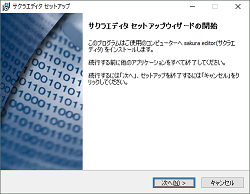
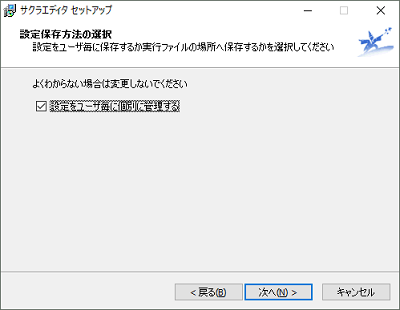
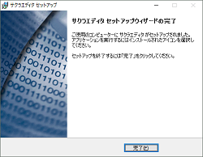
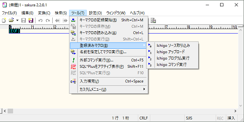
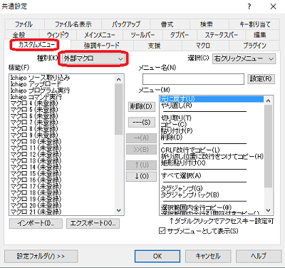
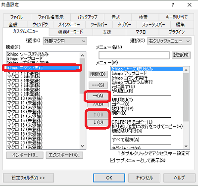
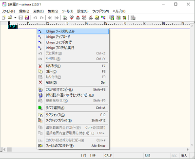

# ichigotools
##IchigoJam支援コマンド Windows版

## 概要
- コマンドプロンプト上で利用するキャラクタインタフェースのコマンドです。
- IchigoJam支援コマンドは、IchigoJam上のプログラムをパソコンに保存したり、  
  パソコン上のプログラムをIchigoJamに読み込むことが出来ます。
- パソコンからIchigoJamに命令文を送って実行することも出来ます。
- サクラエディタ(テキストエディタ)からコマンドを呼び出して利用出来ます。  

## 利用環境
- IchigoJam本体(ファームウェア V1.2.1以降推奨)  
- ホストパソコン
  OSとしてWindows 10搭載機(多分,XP以降なら動くと思います)  
- USB-UARTモジュール
  パソコンとIchigoJamでシリアル通信が出来ること(115,200bps)  

  

## インストール  
ディレクトリ構成の**配布/ichigotools**が実行モジュールです。  

- rsave.exe	リモートセーブコマンド … IchigoJam上のプログラムをパソコン上に保存します。	  　
- rload.exe	リモートロードコマンド … パソコン上のプログラムをIchigoJamにロードします。 
- rcmd.exe	リモート実行コマンド    … IchigoJam上で任意のコマンドを実行します。  
- macro_setup.exe	  マクロ登録コマンド         … サクラエディタからコマンド利用を行うマクロを登録します。  
- macro_setup_1.bat マクロ登録用バッチファイル  … 個別環境設定時のサクラエディタ マクロ登録バッチファイル  
- macro_setup_2.bat マクロ登録用バッチファイル  … 共通環境設定時のサクラエディタ マクロ登録バッチファイル  
- マニュアル.txt	本マニュアル
- neko.bas 動作確認用ichigojam BASICプログラム  

ichigotoolsを各自の環境に応じて配置して下さい。  
ここでは、**C:\ichogotools**に配置するものとします。  
追加ランタイムインストールするモジュールは不要です。  

### 注意
OSのセキュリティ対策で、インターネット経由で取得した場合は  
各実行モジュール(拡張子 EXEのファイル)にセキュリティブロックが、  
付加される場合があります。この場合はコマンドを実行することが出来ません。  
対策として、エクスプローラで実行モジュール(拡張子 EXEのファイル)の  
プロパティを開き、セキュリティの項目の[ブロック解除]ボタンを押してブロックを解除して下さい。  
  

### サクラエディタのインストールとマクロ登録  
サクラエディタ（テキストエディタ）にて本ツールを利用する場合は、本節の設定を行って下さい。  

#### サクラエディタのインストール  
##### 1)ダウンロード  
 下記のサイトより、sakura_install2-2-0-1.exe をダウンロードして下さい。  
 http://sakura-editor.sourceforge.net/download.html  

##### 2)インストール  
sakura_install2-2-0-1.exeを実行し、インストールを開始します。  
  

設定保存方法の選択は「設定をユーザ毎に個別に管理する」にチェックを付けて下さい。  
  

  
##### 3)サクラエディタの起動  
サクラエディタを起動します。  
初回起動時にサクラエディタ用の環境設定ファイルが作成されます。  

##### 4)サクラエディタの終了  
サクラエディタ終了します。  
タスクトレイに常駐している場合は、必ず終了させて下さい。  
常駐している場合は、5)の作業が正常に行えません。  

##### 5-1)マクロの登録(標準)  
C:\ichogotoolsのフォルダを開きmacro_setup_1.bat をメモ帳で編集します。   
次の設定をシリアルポート番号(com5)を各自の環境合わせて修正して下さい。  

    set port=com5

修正後、ダブルクリックして実行します。  
このバッチファイルは、サクラエディタの環境設定ファイルsakura.iniの更新とマクロファイルを作成します。  

    C:\Users\<ユーザー名>\AppData\Roaming\sakura\sakura.ini  
    C:\Users\<ユーザー名>\AppData\Roaming\sakura\makuro\rload.mac  
    C:\Users\<ユーザー名>\AppData\Roaming\sakura\makuro\rsave.mac  
    C:\Users\<ユーザー名>\AppData\Roaming\sakura\makuro\run.mac  
    C:\Users\<ユーザー名>\AppData\Roaming\sakura\makuro\rcmd.vbs  

サクラエディタを起動し、マクロが登録されていることを確認します。  
  

(注意1)  
サクラエディタが既にインストールされている場合で、設定保存方法の選択が  
「設定をユーザ毎に個別に管理する」でない場合はこの作業でのマクロ登録は出来ません。  
**5-2)マクロの登録(非標準)**の手順でマクロ登録を行って下さい。  

(注意2)  
既に別途マクロの登録を行っている場合は、再設定が必要になります。  
本作業の前に、再設定が出来よう、バックアップ及びメモを残すことをお勧めします。  

##### 5-2)マクロの登録(非標準)  
既にサクラエディタがインストール済みで設定保存方法が「設定をユーザ毎に個別に管理する」でない場合は、  
**macro_setup_1.bat**を修正のうえ、実行して下さい。  

    set port=com5
    set sakura=C:\tools\sakura2-1-1-3_x64
    set macro=%sakura\macro

シリアルポート番号(com5)を各自の環境合わせて修正して下さい。  
sakura=にサクラエディタのインストールフォルダを指定してください。   
既に他のフォルダにマクロファイルを登録している場合は、macroにそのフォルダパスを指定して下さい。  
修正後、ダブルクリックして実行します。  
これにより、指定フォルダにマクロファイルを登録します。  

##### 6)カスタムメニューの設定
マウス右クリック時に表示されるメニューからマクロを起動出来るように設定します。  

サクラエディタを起動し、メニュー[設定]-[共通設定]を選択し、[共通設定画面]を開きます。   
[カスタメニュー]タブを選択し、種別で[外部マクロ]を選択します。  
  

左側リストの登録したマクロを右側の左クリックメニューのリストに追加します。  
  

マウス右クリックして、メニューに登録されていることを確認します。  
  

### 利用準備
- 事前に、IchigoJamとパソコン間でシリアル接続をして下さい。  
- 利用するシリアルポート番号を事前に確認して下さい。  
  デバイスマネージャーまたは、コマンドプロンプト上で**mode**コマンドで調べることが出来ます。  
    
- デバイスマネージャーにてシリアルポート番号の変更が可能です。  
    

## コマンドリファレンス  
### rsave.exe リモートセーブコマンド  
#### 形式
rsave COMn ファイル名  
#### 例
rsave COM5 たのしいゲーム.txt  
   
#### 説明  
シリアル通信経由で、IchigoJamにてLISTコマンドを実行して、その出力を  
パソコン上に取り込み、指定したファイル名にて保存します。  
保存するファイル形式はプレーンテキストです。  

### rload.exe リモートロードコマンド 
#### 形式
rload COMn ファイル名 [文字ウェイト時間ms  行ウェイト時間ms] 
#### 例
rload COM5 たのしいゲーム.txt  
rload COM5 たのしいゲーム.txt 25 400  
#### 説明  
シリアル通信経由で、IchigoJamにてNEWコマンドを実行して、プログラムを消去後、  
パソコン上の指定したファイルを行単位でIchigoJamに転送し、IchigoJamにロードします。  

デフォルトでは処理として、一行毎に18ミリ秒、１文字毎に18ミリ秒の待ちを行っています。  
IchigoJamのファームウェアバージョンが1.2.1以前で利用の場合は、  
文字ウェイト時間ms、行ウェイト時間msをそれぞれ25、400程度に設定して下さい。  
プログラムサイズが大きい場合、場合時間がかかります。  

### rcmd.exe リモート実行コマンド  
#### 形式
rcmd COMn 命令文   
####例
rcmd COM5 LIST  
rcmd COM5 PRINT ￥"Hello World￥"   
rcmd COM5 PRINT 1+1  
rcmd COM5 LIST > hogehoge.txt  
#### 説明  
シリアル通信経由で、IchigoJam上でコマンドを実行します。  
実行した出力結果はシリアル通信でパソコンで取り込み、表示します。  
PRINT文などで使う "(ダブルクォーテーション)文字を使う場合は、  
エスケープシーケンス文字￥+” とします。  
本コマンドは、ゲーム等のスクリーン座標を制御するプログラムの実行には向きません。  

## 開発環境  
- Microsoft Windows 10 Pro  
- Microsoft Visual Studio Express 2013 for Windows Desktop  
